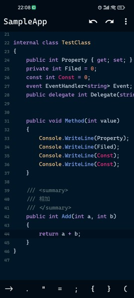
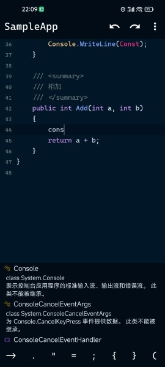
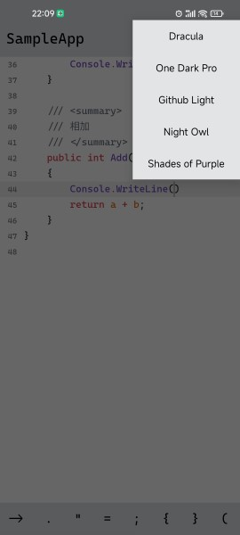

# 基于[roslyn](https://github.com/dotnet/roslyn)的c#代码编辑器

## 平台支持

- [x] android
- [ ] windows

## 特征

- 代码高亮
- 自动完成
- 代码格式化
- 注释显示
- 自动缩进
- 撤销/重做

## 待办
- 代码诊断
- 搜索/替换
- 剪贴板功能

## 截图

## 鸣谢项目
- [roslyn](https://github.com/dotnet/roslyn)
- [sora-editor](https://github.com/Rosemoe/sora-editor)